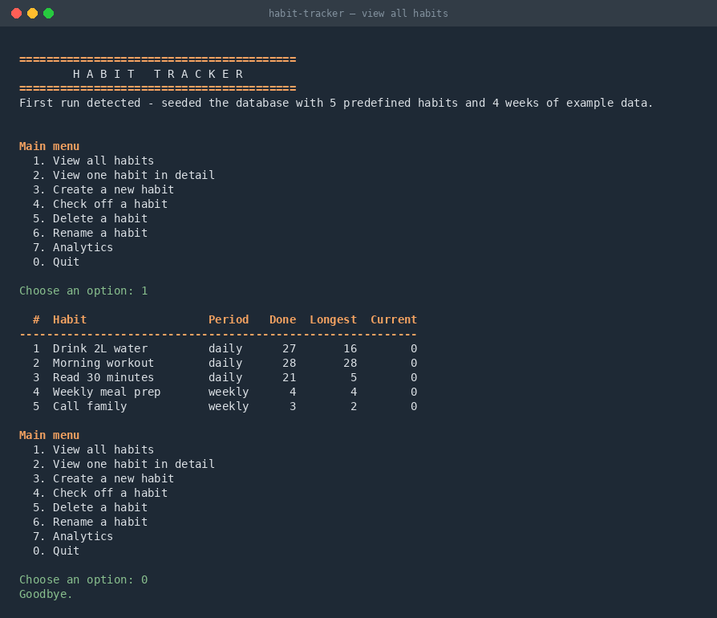
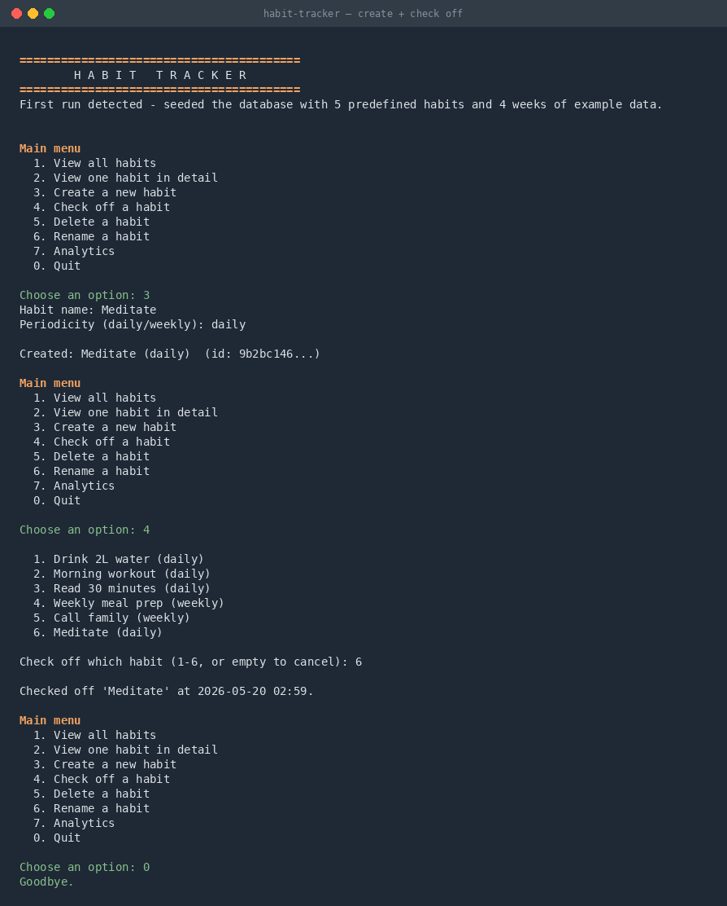
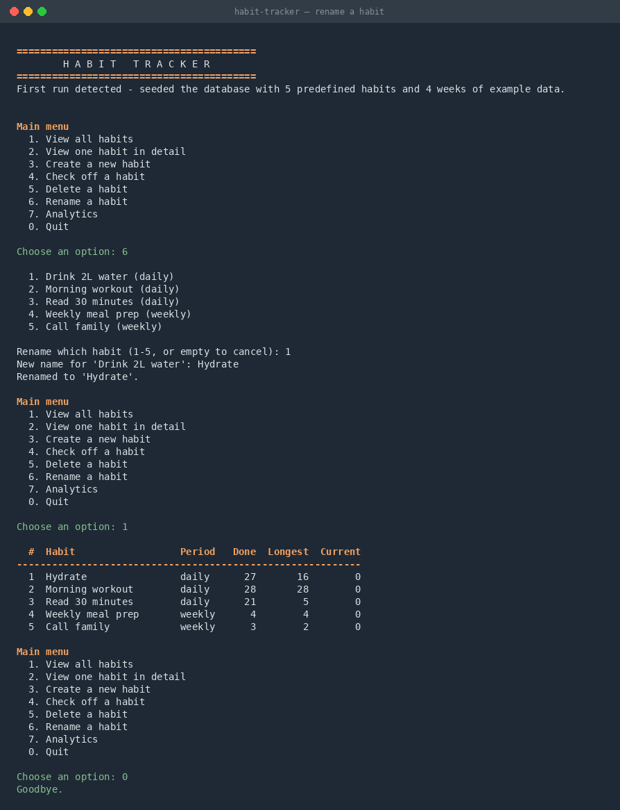
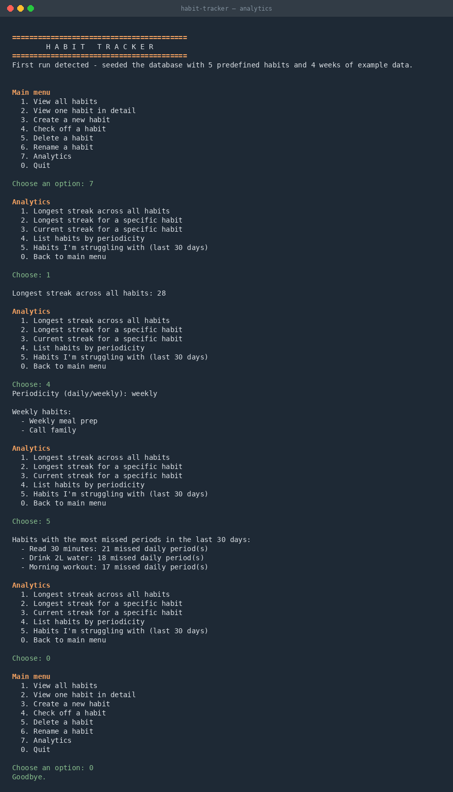
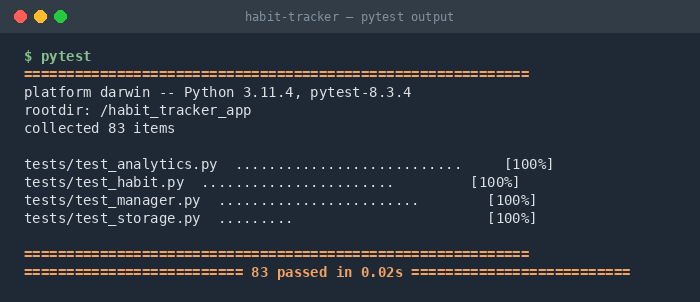

# Habit Tracker

A Python backend for tracking daily and weekly habits, built for the IU course
**Object Oriented and Functional Programming with Python (DLBDSOOFPP01)**.

The application lets a user define habits, record check-offs, and analyse
their performance over time. The codebase combines object-oriented design
(the `Habit` domain class and `HabitManager` orchestrator) with a pure
functional analytics module.

---

## Requirements

- **Python 3.7 or later** — the application uses only the standard library
  (`sqlite3`, `dataclasses`, `datetime`, `enum`, `itertools`, `functools`,
  `typing`, `uuid`).
- **pytest** is required only to run the test suite. It is the sole entry
  in `requirements.txt`.

No other third-party dependencies.

---

## Installation

```bash
# Clone the repository
git clone https://github.com/<your-user>/<your-repo>.git
cd <your-repo>/habit_tracker_app

# Optional but recommended: create a virtual environment
python3 -m venv .venv
source .venv/bin/activate         # macOS / Linux
# .venv\Scripts\activate          # Windows PowerShell

# Install development dependencies (only pytest)
pip install -r requirements.txt
```

---

## Running the application

```bash
python main.py
```

On first launch the application creates `habits.db` (a SQLite file) in the
current directory and seeds it with **five predefined habits and four weeks
of example completion data**. Subsequent launches reuse the existing
database. To start fresh, simply delete `habits.db` and run `main.py` again.

### CLI menu

```
Main menu
  1. View all habits
  2. View one habit in detail
  3. Create a new habit
  4. Check off a habit
  5. Delete a habit
  6. Rename a habit
  7. Analytics
  0. Quit
```

| Option | Behaviour |
| --- | --- |
| 1 | Lists all habits with completion count, longest streak, and current streak. |
| 2 | Shows one habit's metadata, streaks, and the ten most recent completions. |
| 3 | Prompts for a name and periodicity (`daily` or `weekly`) and creates a new habit. |
| 4 | Records a completion event for the chosen habit at the current time. |
| 5 | Permanently deletes a habit and all of its completion history (with confirmation). |
| 6 | Renames a habit. The completion history is preserved. |
| 7 | Opens the analytics sub-menu (see below). |

### Analytics sub-menu

```
Analytics
  1. Longest streak across all habits
  2. Longest streak for a specific habit
  3. Current streak for a specific habit
  4. List habits by periodicity
  5. Habits I'm struggling with (last 30 days)
  0. Back to main menu
```

All analytics functions are implemented as **pure functions** in
`habit_tracker/analytics.py`, using `map`, `filter`, `reduce`,
`sorted`, and `itertools.takewhile`.

### Screenshots

**Main menu and listing all habits**



**Creating a new habit and checking it off**



**Renaming a habit (completion history preserved)**



**Analytics sub-menu — querying the longest streak and filtering by periodicity**



---

## Predefined habits and four-week test data

The fixture is anchored to **Monday 6 April 2026** and runs for 28 days
(four ISO weeks, ending Sunday 3 May 2026). Each habit's completion
pattern is deliberate and matches the values asserted by the test suite:

| Habit | Period | Completed | Designed pattern |
| --- | --- | --- | --- |
| Drink 2L water | daily | 27 / 28 | One missed day; longest streak 16 |
| Morning workout | daily | 28 / 28 | Perfect streak |
| Read 30 minutes | daily | 21 / 28 | Five short segments, longest 5 |
| Weekly meal prep | weekly | 4 / 4 | Perfect weekly streak |
| Call family | weekly | 3 / 4 | One missed week, longest 2 |

This data is used both to seed the application on first launch and as a
fixture for the unit-test suite, so the same numbers are exercised by
both interactive demos and automated tests.

---

## Running the tests

```bash
pytest
```

The suite contains **83 tests** across four files, mirroring the source
modules:

| Test file | Tests | What it covers |
| --- | --- | --- |
| `tests/test_habit.py` | 23 | Domain class: construction, validation, period bounds, completion checks, rename. |
| `tests/test_storage.py` | 9 | SQLite persistence, foreign-key cascade, UPSERT semantics. |
| `tests/test_analytics.py` | 27 | Pure FP analytics against the four-week fixture. |
| `tests/test_manager.py` | 24 | Orchestration, validation, error propagation, analytics passthroughs, rename. |

All tests run against in-memory SQLite databases (`":memory:"`) — no files
are created and the suite is fully isolated and deterministic.



---

## Project structure

```
habit_tracker_app/
├── main.py                  # Application entry point
├── requirements.txt         # pytest only
├── .gitignore
├── README.md
│
├── habit_tracker/           # Application package
│   ├── __init__.py
│   ├── habit.py             # Habit class (OOP, with Periodicity enum)
│   ├── storage.py           # SQLite persistence layer
│   ├── analytics.py         # Pure functional analytics
│   ├── manager.py           # Orchestration layer
│   ├── cli.py               # Command-line interface
│   └── fixtures.py          # Predefined habits + 4-week test data
│
├── tests/
│   ├── conftest.py          # Shared pytest fixtures
│   ├── test_habit.py
│   ├── test_storage.py
│   ├── test_analytics.py
│   └── test_manager.py
│
└── docs/
    └── screenshots/         # CLI and pytest screenshots used by this README
```

---

## Architecture

The dependency graph is one-way and deliberately narrow:

```
   cli ──▶ manager ──▶ { storage, analytics, fixtures }
                 │
                 ▼
              habit (domain class)
```

- **`habit.py`** is the only OOP domain class.
- **`analytics.py`** contains only pure functions — no I/O, no `datetime.now()`,
  no mutation of inputs. Streak logic uses `map` + `set` + `reduce`; the
  current-streak walk uses `itertools.takewhile`.
- **`storage.py`** is the only module that talks to SQLite. Two tables
  (`habits` and `completions`) connected by a foreign key with `ON DELETE
  CASCADE`. UPSERT is used instead of `INSERT OR REPLACE` to avoid
  cascade-deleting completions on re-saves.
- **`manager.py`** validates input, raises typed exceptions
  (`HabitNotFoundError`), and is the only module that imports across all
  three lower layers.
- **`cli.py`** is one front-end among potentially many. The same
  `HabitManager` API could be driven by a Tkinter desktop UI or a Flask
  web layer without modifying anything else.

This separation is what makes the analytics functions trivially testable
(they take data, return data) and what would let the user-interface layer
be swapped out in a future iteration of the project.

---

## Documentation

Every module, class, and public function is documented with Python
docstrings following the Google style. Type hints are used throughout
to make the intent of each parameter and return value explicit.
